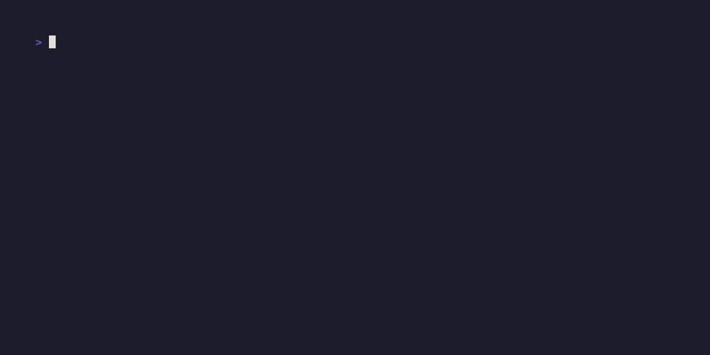

# RottenCLI: Rotten Tomatoes in Your Terminal

A Go-based terminal user interface for searching and retrieving movie ratings from Rotten Tomatoes.

## Demo




## Features

- Search for movies by title
- Beautiful terminal UI with keyboard navigation
- Display movie details including critic and audience scores
- Open movie pages directly in your web browser
- Fast and lightweight with minimal dependencies

## Features to be implemented
- Display more movie information on movie page such as cast, director etc.
- Display movie thumbnail in movie page
- Display movie thumbnail in search results list
- Creating personal movie lists stored locally and adding movies to them
- Big Beast: adding movies to one's rotten tomatoes watchlist (requires login yada yada)

## Installation

### From Binary (Recommended)

Download the latest release from the [Releases](https://github.com/yourusername/RottenTomatoesCLI/releases) page.

### From Source

1. Ensure you have Go 1.18 or later installed
2. Clone this repository
   ```bash
   git clone https://github.com/yourusername/RottenTomatoesCLI.git
   cd RottenTomatoesCLI
   ```
3. Build the application:
   ```bash
   cd rt-tui
   go build -o rotten
   ```
4. Optionally, move the binary to your PATH (in order to use "rotten" as keyword in terminal):
   ```bash
   sudo mv rotten /usr/local/bin/
   ```

## Usage

1. Launch the application (or just type "rotten" in your terminal if you moved the binary into your PATH above):
   ```bash
   ./rotten
   ```

2. Enter a movie title in the search box and press Enter
3. Navigate through search results using the up/down arrow keys (or j/k)
4. Press Enter to view detailed information about the selected movie
5. In the movie details view:
   - Press Enter to open the movie page in your web browser
   - Use arrow keys to scroll through longer descriptions
   - Press Esc to go back to the results
   - Press q to quit

### Keyboard Shortcuts

- **↑/↓ or j/k**: Navigate through results
- **Enter**: Select movie / Open in browser
- **Esc**: Go back to previous screen
- **q or Ctrl+C**: Quit the application
- **Option+Backspace**: Delete a whole word when typing (macOS)

## Project Structure

- `rt-tui/` - Go implementation of the terminal UI
  - `main.go` - Entry point of the application
  - `ui.go` - Terminal UI implementation using Bubble Tea
  - `api.go` - API client for Rotten Tomatoes

## Dependencies

- [Bubble Tea](https://github.com/charmbracelet/bubbletea) - Terminal UI framework
- [Bubbles](https://github.com/charmbracelet/bubbles) - TUI components for Bubble Tea
- [Lip Gloss](https://github.com/charmbracelet/lipgloss) - Style definitions for terminal applications
- [goquery](https://github.com/PuerkitoBio/goquery) - HTML parsing

## Development

This project is actively under development (is it though you yapper?). Contributions are welcome!

To contribute:
1. Fork the repository
2. Create a feature branch
3. Submit a pull request

## License

MIT License

## Acknowledgements

- [Rotten Tomatoes](https://www.rottentomatoes.com/) for the movie data
- The authors and maintainers of the Go libraries used in this project (charmbracelet those absolute legends)